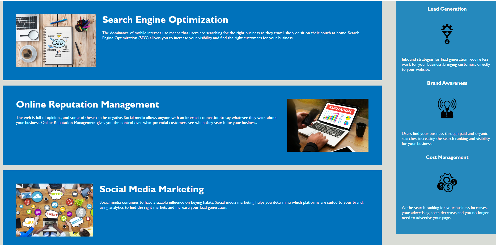

# module-1-eduardo-arellano
Eduardo Arellano Module 1 Challenge Assignment
# 📖 Refactor the original code to make it more accessible for other developers.

* The original code will be updated and changed to include semantic HTML structure

* All links should be functioning correctly

* Rework the CSS to make it more efficient by consolidating CSS selectors and properties. Organizing them to follow the semantic structure of the HTML elements

Application URL link;

https://arellanoe.github.io/module1-challenge-eduardo-arellano/

## Acceptance Criteria

* WHEN I view the source code
* THEN I find semantic HTML elements
* WHEN I view the structure of the HTML elements
* THEN I find that the elements follow a logical structure
* independent of styling and positioning
* WHEN I view the image elements
* THEN I find accessible alt attributes
* WHEN I view the heading attributes
* THEN they fall in sequential order
* WHEN I view the title element
* THEN I find a concise, descriptive title
